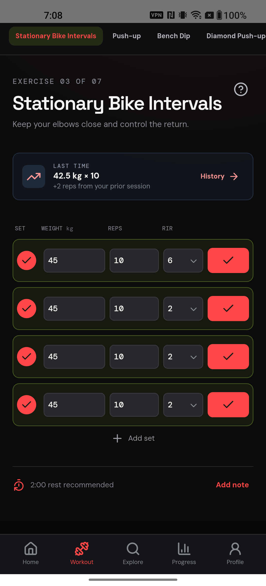
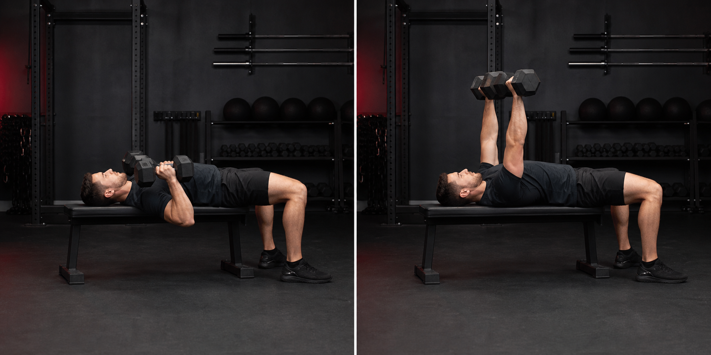
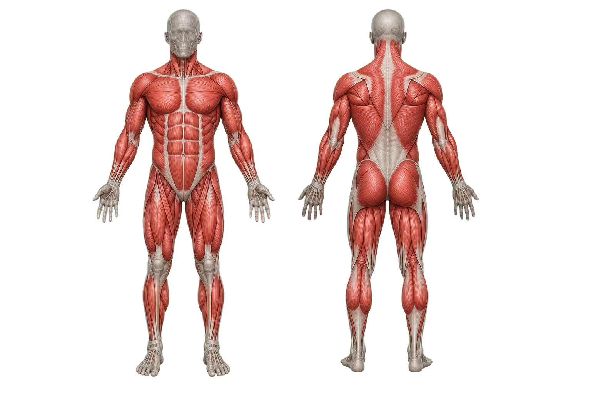
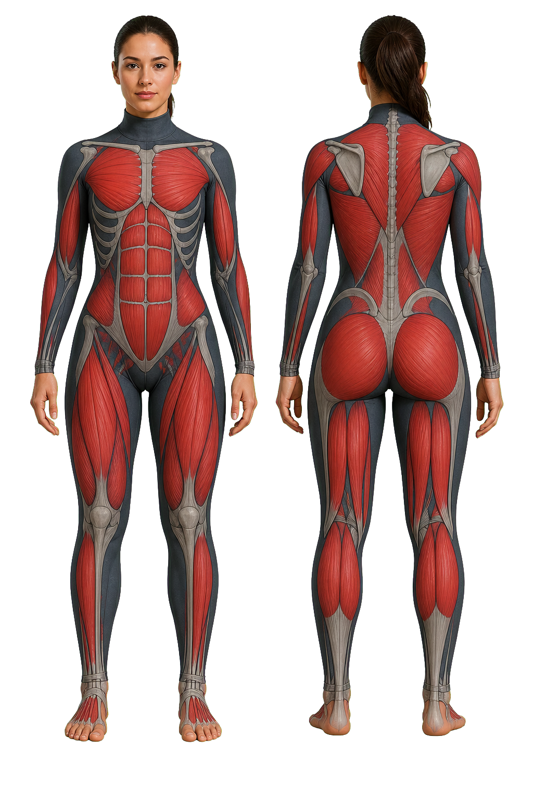
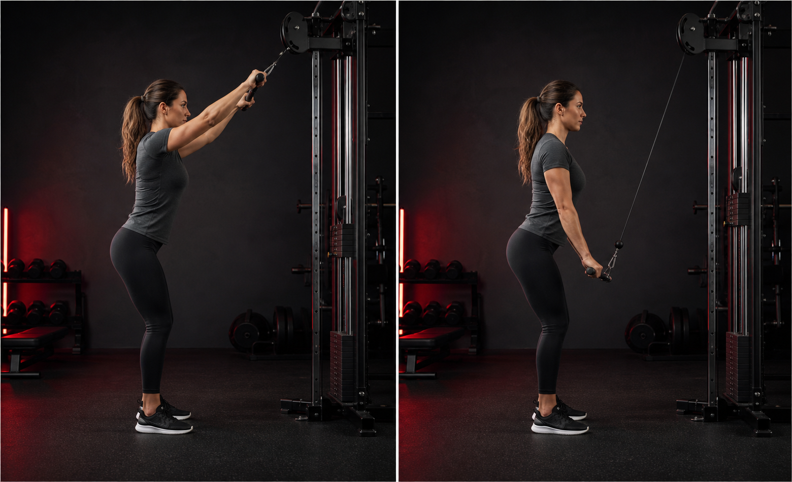
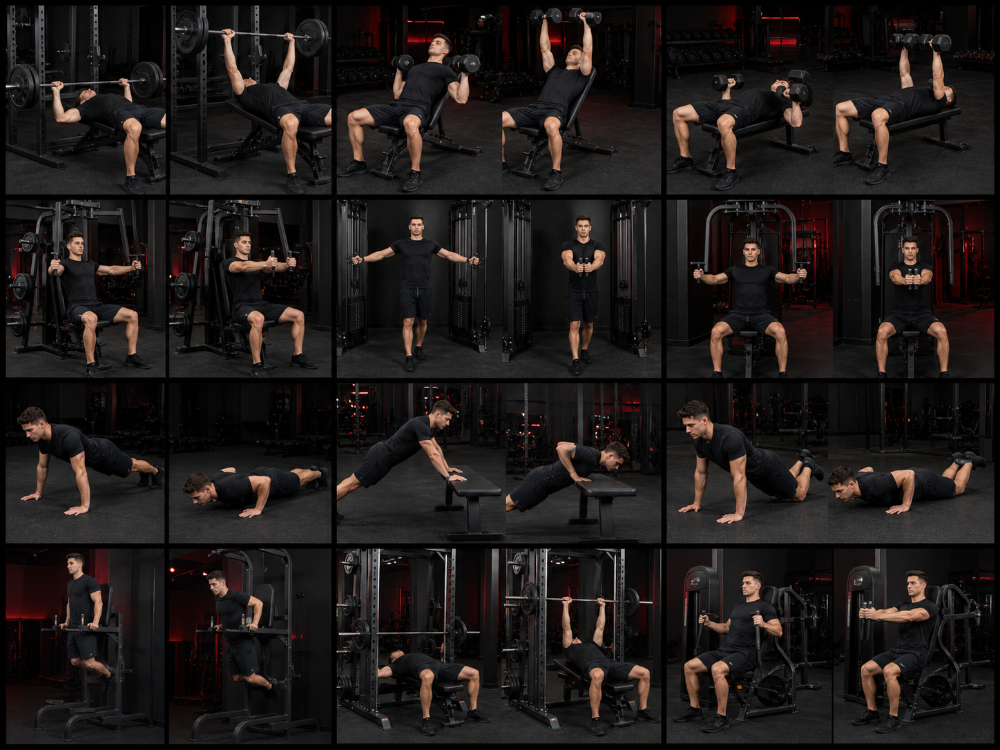

# Pro Fitness portfolio gallery

These six visuals are genuine Pro Fitness product assets and workout captures.
They can be used in the GitHub repository, a developer portfolio, or a case
study. They should not be used as Google Play screenshots until they have been
captured from the final installed app without browser or device overlays.

| Section | Visual | What it shows |
| --- | --- | --- |
| Workout logging |  | Set-by-set logging with load, reps, RIR, rest guidance, and individual completion controls. |
| Chest form coach |  | Exercise form reference with an easy-to-follow press position. |
| Male muscle focus |  | Live muscle-focus anatomy used during male workout guidance. |
| Female muscle focus |  | Female-specific muscle-focus anatomy used during female workout guidance. |
| Female form coach |  | Female form-reference visual for pull movements. |
| Chest exercise reference |  | A two-position chest exercise reference that supports the technique guide. |

## Product sections to highlight

1. **Home** — readiness, daily training direction, and weight-aware planning.
2. **Workout** — warm-up, individual sets, rest timer, completion, and history.
3. **Explore** — exercises by body part, equipment, training goal, and level.
4. **Technique lab** — clear form references, push/pull pattern, and muscle focus.
5. **Nutrition and progress** — macro targets, food and water logging, check-ins, and measurements.
6. **Profile and privacy** — local data controls, reminders, export, and deletion.

## Suggested portfolio caption

> Pro Fitness is a local-first, goal-aware Android fitness coach. I designed
> the product around practical gym execution: the next workout, exact form,
> targeted muscles, nutrition targets, and durable progress history—all while
> keeping personal health information on the device.
